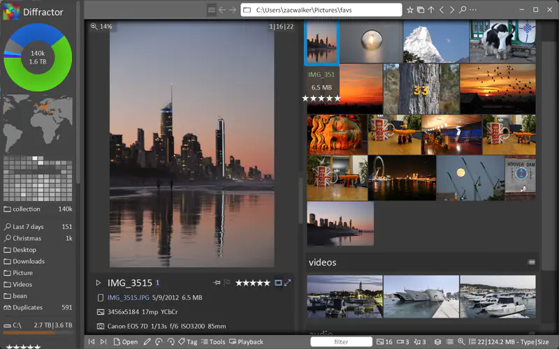

# Diffractor
[](https://github.com/diffractor/diffractor/actions/workflows/msbuild.yml)

Free, high-performance photo and video organizer for Windows. Optimized for speed and local file control�no cloud storage or subscriptions required.



## Features

| Category | Capabilities |
|----------|-------------|
| **Viewing** | Unified photo/video/audio playback; native support for most formats including RAW |
| **Search** | Instant metadata-based search (tags, location, camera data) via local indexing |
| **Metadata** | Read/write XMP, IPTC, EXIF, ID3; add tags, ratings, location |
| **Organization** | Side-by-side comparison, duplicate detection ("Presence" feature) |
| **Sync** | Bidirectional sync to NAS/network drives for backup and collaboration |
| **Editing** | Resize, rotate, crop, color adjustment |

## Quick Start

1. Download from [diffractor.com](https://diffractor.com/) and install
2. Point to your media folders�Diffractor indexes automatically
3. Browse via sidebar (date, location, folder, file type)
4. Apply ratings/tags via keyboard shortcuts or UI; use Compare view for burst sorting
5. Sync to network drives; use metadata tools for maintenance

**Why Diffractor?** Fast (handles large libraries without lag), private (local-only), lightweight, free.

## Deployment Options

| Distribution | Description |
|--------------|-------------|
| **Windows Desktop** | Traditional installer (`diffractor-setup.exe`) with auto-update support |
| **Windows Store** | MSIX package for Microsoft Store distribution (updates handled by Store) |
| **Portable** | ZIP archive for standalone use without installation |

Both Desktop and Store builds share the same codebase. The `WINSTORE` preprocessor define controls Store-specific behavior (disables built-in auto-update since the Store handles updates).

## Building

```bash
git clone --recursive https://github.com/diffractor/diffractor.git
```

Open `df.sln` in Visual Studio 2022. Submodules: [FFmpeg](https://github.com/diffractor/FFmpeg), [XMP-SDK](https://github.com/diffractor/XMP-Toolkit-SDK).

### Build Script

Use `dd.ps1` from a Developer PowerShell:

| Command | Description |
|---------|-------------|
| `.\dd.ps1` | Show usage information and current version |
| `.\dd.ps1 desktop` | Build desktop versions (Win32 + x64), auto-increments build number |
| `.\dd.ps1 store` | Build Windows Store MSIX package, auto-increments build number |
| `.\dd.ps1 run` | Run the recently built diffractor64.exe |
| `.\dd.ps1 bump-build` | Manually increment build number without building |
| `.\dd.ps1 bump-ver` | Increment minor version (e.g., 1.26.2 ? 1.26.3) |

**Prerequisites for release builds:** NSIS, 7-Zip, Windows SDK, code signing certificate.

See [implementation.md](implementation.md) for architecture details.

## Contributing

Contributions welcome via [issues](https://github.com/diffractor/diffractor/issues).

**Translations:** Edit PO files with [poedit](https://poedit.net/). Files in [exe/languages](https://github.com/diffractor/diffractor/tree/master/exe/languages). Use German as template for new languages. Test by copying to `%LOCALAPPDATA%\Diffractor\languages`.

**Tests:** Built-in runner accessible via toolbar checkmark button when launched from Visual Studio. Press Escape to exit test mode. Command-line test runs are also supported with `diffractor64.exe /test` or `diffractor64.exe /test:*filter*`; the process exits with `0` when all selected tests pass and `1` when any test fails.

## Dependencies

No package manager is used. Source code for each library is copied into `third-party/` (or `Include/` for header-only libs) and built via custom `.vcxproj` files maintained in this repo. To update a dependency: download/clone the new source, replace the files in the corresponding folder, adjust the `.vcxproj` if source files were added/removed, and verify the build.

| Library | Version | Folder | Type | Update Source |
|---------|---------|--------|------|---------------|
| [brotli](https://github.com/google/brotli) | 1.2.0 | `third-party/brotli` | Source copy | Download release from [google/brotli](https://github.com/google/brotli/releases), replace `c/` sources |
| [bzip2](https://github.com/libarchive/bzip2) | 1.0.8 | `third-party/bzip2` | Source copy | Download from [libarchive/bzip2](https://github.com/libarchive/bzip2/releases) |
| [dav1d](https://code.videolan.org/videolan/dav1d) | 1.4.3 | `third-party/dav1d` | Source copy | Clone from [videolan/dav1d](https://code.videolan.org/videolan/dav1d), copy sources, regenerate `vcs_version.h` |
| [dng-sdk](https://github.com/niclaswue/dng_sdk) | 1.7.1 | `third-party/dng` | Source copy | Download from [Adobe DNG SDK](https://helpx.adobe.com/camera-raw/digital-negative.html), mirror at [niclaswue/dng_sdk](https://github.com/niclaswue/dng_sdk) |
| [expat](https://github.com/libexpat/libexpat) | 2.8.2 | `third-party/expat` | Source copy | Download release from [libexpat/libexpat](https://github.com/libexpat/libexpat/releases), replace `lib/` sources |
| [ffmpeg](https://github.com/diffractor/FFmpeg) | main | `third-party/FFmpeg` | **Fork** (submodule) | Rebase [diffractor/FFmpeg](https://github.com/diffractor/FFmpeg) on upstream [FFmpeg/FFmpeg](https://github.com/FFmpeg/FFmpeg). Fork adds custom `ffmpeg.vcxproj` for MSVC |
| [highway](https://github.com/google/highway) | 1.4.0 | `third-party/highway` | Source copy | Download release from [google/highway](https://github.com/google/highway/releases) |
| [hunspell](https://github.com/hunspell/hunspell) | 1.7.3 | `third-party/hunspell` | Source copy | Download release from [hunspell/hunspell](https://github.com/hunspell/hunspell/releases), replace `src/hunspell/` sources |
| [libarchive](https://github.com/libarchive/libarchive) | 3.8.8 | `third-party/libarchive` | Source copy | Download release from [libarchive/libarchive](https://github.com/libarchive/libarchive/releases) |
| [libde265](https://github.com/strukturag/libde265) | 1.1.1 | `third-party/libde265` | Source copy | Download release from [strukturag/libde265](https://github.com/strukturag/libde265/releases), update `de265-version.h` |
| [libebml](https://github.com/Matroska-Org/libebml) | 1.4.5 | `third-party/libebml` | Source copy | Download release from [Matroska-Org/libebml](https://github.com/Matroska-Org/libebml/releases) |
| [libexif](https://github.com/libexif/libexif) | 0.6.26 | `third-party/libexif` | Source copy | Download release from [libexif/libexif](https://github.com/libexif/libexif/releases) |
| [libheif](https://github.com/strukturag/libheif) | 1.23.1 | `third-party/libheif` | Source copy | Download release from [strukturag/libheif](https://github.com/strukturag/libheif/releases), update `heif_version.h` |
| [libjpeg-turbo](https://github.com/libjpeg-turbo/libjpeg-turbo) | 3.2.0 | `third-party/LibJpeg` | Source copy | Download release from [libjpeg-turbo/libjpeg-turbo](https://github.com/libjpeg-turbo/libjpeg-turbo/releases), place sources under `src/` (upstream layout), regenerate `src/jconfig.h` for MSVC |
| [libjxl](https://github.com/libjxl/libjxl) | 0.12.0 | `third-party/libjx` | Source copy | Download release from [libjxl/libjxl](https://github.com/libjxl/libjxl/releases), take the source lists from `lib/jxl_lists.cmake`, update `jxl/version.h` |
| [liblzma](https://github.com/tukaani-project/xz) | 5.8.3 | `third-party/liblzma` | Source copy | Download release from [tukaani-project/xz](https://github.com/tukaani-project/xz/releases), copy `src/liblzma/` sources |
| [libmatroska](https://github.com/Matroska-Org/libmatroska) | 1.7.1 | `third-party/libmatroska` | Source copy | Download release from [Matroska-Org/libmatroska](https://github.com/Matroska-Org/libmatroska/releases) |
| [libopenmpt](https://github.com/OpenMPT/openmpt) | 0.8.3 | `third-party/libopenmpt` | Source copy | Download release from [lib.openmpt.org](https://lib.openmpt.org/libopenmpt/download/), mirror at [OpenMPT/openmpt](https://github.com/OpenMPT/openmpt) |
| [libpng](https://github.com/pnggroup/libpng) | 1.6.58 | `third-party/libpng` | Source copy | Download release from [pnggroup/libpng](https://github.com/pnggroup/libpng/releases) |
| [LibRaw](https://github.com/LibRaw/LibRaw) | 0.22.1 | `third-party/LibRaw` | Source copy | Download release from [LibRaw/LibRaw](https://github.com/LibRaw/LibRaw/releases) |
| [libwebp](https://github.com/webmproject/libwebp) | 1.6.0 | `third-party/webp` | Source copy | Download release from [webmproject/libwebp](https://github.com/webmproject/libwebp/releases) |
| [minizip-ng](https://github.com/zlib-ng/minizip-ng) | 3.0.6 | `third-party/minizip` | Source copy | Download release from [zlib-ng/minizip-ng](https://github.com/zlib-ng/minizip-ng/releases) |
| [parallel-hashmap](https://github.com/greg7mdp/parallel-hashmap) | 2.0.0 | `Include/parallel_hashmap` | Header-only | Copy headers from [greg7mdp/parallel-hashmap](https://github.com/greg7mdp/parallel-hashmap/releases) into `Include/parallel_hashmap/` |
| [rapidjson](https://github.com/Tencent/rapidjson) | main | `third-party/rapidjson` | Header-only | Copy headers from [Tencent/rapidjson](https://github.com/Tencent/rapidjson) `include/rapidjson/` |
| [skcms](https://github.com/niclaswue/skcms) | main | `third-party/skcms` | Source copy | Copy from [skia.googlesource.com/skcms](https://skia.googlesource.com/skcms), mirror at [niclaswue/skcms](https://github.com/niclaswue/skcms) |
| [sqlite](https://github.com/niclaswue/sqlite) | 3.53.3 | `third-party/sqlite` | Source copy | Download amalgamation from [sqlite.org](https://www.sqlite.org/download.html), mirror at [niclaswue/sqlite](https://github.com/niclaswue/sqlite) |
| [utf-cpp](https://github.com/nemtrif/utfcpp) | 4.1.1 | `Include/utf8-cpp` | Header-only | Copy headers from [nemtrif/utfcpp](https://github.com/nemtrif/utfcpp/releases) into `Include/utf8-cpp/` |
| [xmp-sdk](https://github.com/diffractor/XMP-Toolkit-SDK) | 6.0.0 | `third-party/xmp` | **Fork** (submodule) | Rebase [diffractor/XMP-Toolkit-SDK](https://github.com/diffractor/XMP-Toolkit-SDK) on upstream [adobe/XMP-Toolkit-SDK](https://github.com/adobe/XMP-Toolkit-SDK). Fork adds: POPM/TPE2 reconciliation for MP3, Windows tag support, C++17 fixes, WebP support from Exempi |
| [zlib-ng](https://github.com/zlib-ng/zlib-ng) | 2.3.3 | `third-party/ZLib` | Source copy | Download release from [zlib-ng/zlib-ng](https://github.com/zlib-ng/zlib-ng/releases), configure for zlib-compat mode |
