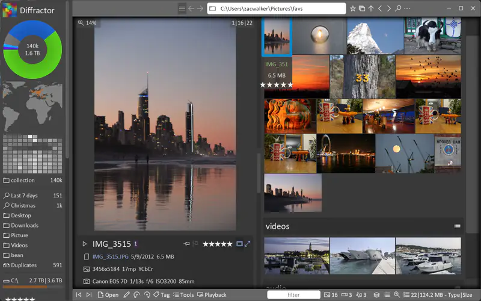

# Diffractor
[](https://github.com/diffractor/diffractor/actions/workflows/windows.yml)

Free, high-performance photo and video organizer for Windows. Optimized for speed and local file control—no cloud storage or subscriptions required.



## Features

| Category | Capabilities |
|----------|-------------|
| **Viewing** | Unified photo/video/audio playback; native support for most formats including RAW |
| **Zoom** | One scale-and-center model across mouse, keyboard, wheel, and touch; hold to inspect, an overview navigator, and linked side-by-side magnification |
| **Search** | Instant metadata-based search (tags, location, camera data) via local indexing |
| **Places** | Photos and videos are placed from GPS alone, searchable by place, city, state, country, or distance, with map and visit-derived grouping |
| **Metadata** | Read/write XMP, IPTC, EXIF, ID3; add tags, ratings, location |
| **Organization** | Side-by-side comparison, and duplicate detection ("Presence") that recognizes a re-encoded, resized, or rotated copy as well as an identical one |
| **Related items** | Finds possible copies, the same album, the same series, and the closest capture times and places, each as its own group |
| **File operations** | Rename, Import, and Sync preview every file before they run, and state how each name collision will be resolved |
| **Sync** | Bidirectional sync to NAS/network drives for backup and collaboration |
| **Editing** | Resize, rotate, crop, perspective, temperature and tint, color adjustment, and automatic color, straighten, and document correction |
| **Languages** | English plus 13 translation catalogs |

## Building

```bash
git clone --recursive https://github.com/diffractor/diffractor.git
```

The build uses CMake and requires Visual Studio, Ninja, and the recursively cloned
[FFmpeg](https://github.com/diffractor/FFmpeg) and
[XMP Toolkit SDK](https://github.com/diffractor/XMP-Toolkit-SDK) submodules.

Everything goes through the `dd` gateway, which finds Visual Studio, configures with Ninja and puts the binary in `exe/`:

```powershell
.\dd.ps1 test                                            # build, lint, test, check translations
python tools/dd.py build --config Release --arch x86     # the 32-bit desktop binary
python tools/dd.py build --winstore                      # the Store binary
```

Release packaging also requires NSIS, 7-Zip, the Windows SDK, and a code-signing
certificate. Run `.\dd.ps1` for the complete command list.

Product behavior is documented in [docs/design.md](docs/design.md). Architecture is
documented in [docs/implementation.md](docs/implementation.md), whose links lead to
the specialized subject documents. Contributor routing and repository rules are in
[AGENTS.md](AGENTS.md).

## Contributing

Contributions are coordinated through [GitHub issues](https://github.com/diffractor/diffractor/issues).
Use [Poedit](https://poedit.net/) for catalogs under `exe/languages`, and run
`.\dd.ps1 test` before submitting a change.

## License

Diffractor is free software.

**Diffractor's own source** — everything in `src/`, `tools` and `cmake/` — is licensed under the
**GNU Lesser General Public License, version 2.1 or later**.

**Released binaries are licensed under the LGPL, version 3.0 or later.** They statically link
[libheif](https://github.com/strukturag/libheif) and [libde265](https://github.com/strukturag/libde265),
both of which are LGPL-3.0-or-later, and LGPL 2.1 cannot absorb LGPL 3 code. Because Diffractor's own
code is offered as "2.1 or later", the combined work resolves to 3.0 or later. Anyone who removes
those two dependencies may use the remaining Diffractor code under 2.1.

The full texts are in [LICENSE](LICENSE) (LGPL-3.0) and [COPYING.GPLv3](COPYING.GPLv3), which LGPL-3.0
incorporates by reference.

Vendored libraries and their terms are listed in
[docs/third-party.md](docs/third-party.md#licensing). FFmpeg is deliberately configured with
`CONFIG_GPL 0`, so no GPL-only component is included and it is used under the LGPL.

