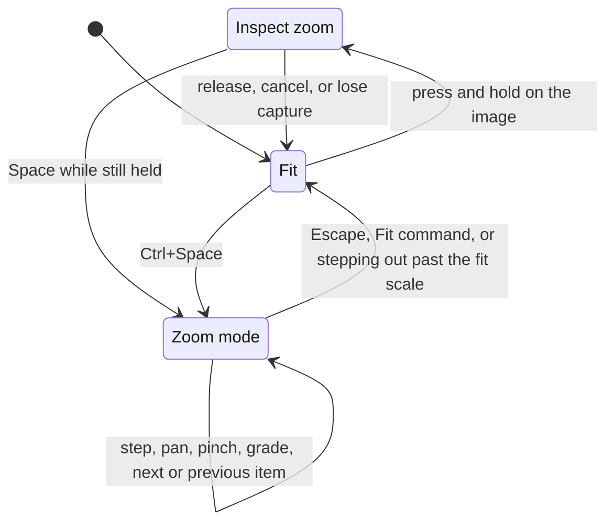

<!-- Reference specification for the zoom experience: what it is for, the model, the behavior contract, and how it is judged. -->

# Zoom

A reference specification for zoom in an image viewer: what zoom is for, the model the user holds, the behavior that follows from it, and how any candidate implementation is judged. It describes a target rather than a build, and it exists to be read and argued with before code is written.

Where the rendering approach changes what is affordable, the document says so explicitly rather than settling for the cheapest option or promising the most expensive one everywhere. §4 is the only place that distinction appears; everything else is common to both.

Within Diffractor this supersedes the open zoom decisions in [design.md](design.md).

**Contents.** §1 purpose · §2 model · §3 laws · §4 rendering tiers · §5 scale · §6 position · §7 continuity · §8 comparison · §9 feedback · §10 image quality · §11 input · §12 accessibility · §13 options · §14 rejected · §15 judgement · §16 implementation status

## 1. What Zoom Is For

Zoom is not one feature. Three jobs share the same controls, and the design succeeds only when all three feel direct.

| Job | What the user is really asking | What that demands |
|---|---|---|
| **Judge** | "Is this shot sharp? Did I miss focus?" | Instant, disposable 1:1 under the pointer, gone the moment they let go |
| **Study** | "What does this detail actually say?" | A durable working size, free panning, and never losing the subject |
| **Compare** | "Which of these two is better?" | The same region, at the same size, across images and across panes |

Most viewers get Judge wrong by making magnification a mode, and few attempt Compare at all. Get those two right and Study follows. The experience is right when a photographer can cull two hundred frames without ever thinking about the zoom feature, and a retoucher can work at 400% for an hour without losing their place.

## 2. The Model

The user should be able to hold one sentence in their head:

> **The image has a size and a center. Every zoom action changes one of them, and both are always visible.**

Immersive layout, decode quality, chrome, and comparison panes are consequences of those two values, never separate things to reason about. Each presented image, primary or comparison, owns exactly two user-facing values.

| Value | Meaning | Domain |
|---|---|---|
| **Scale** | How big the image is | `Fit`, or an explicit percentage |
| **Center** | Which source point sits in the middle of the viewport | A normalized source coordinate from 0 to 1 on each axis |

`Fit` is a calculated *state*, not a remembered percentage. It recalculates whenever the image bounds or source dimensions change, so a fitted image stays fitted through resize, DPI change, chrome changes, and navigation.

Center is expressed in **source-image space**, not as a fraction of the scrollable range. This is the most consequential representation choice in the model: a source-space center is independent of scale, viewport size, and aspect ratio, so it survives zooming, resizing, hiding chrome, and moving to the next image without being recomputed or corrected. Clamping to the image edges happens when the destination rectangle is computed, never in the stored state.

### 2.1 Two magnified states, one zoom

| State | What the user is doing | Scale | Ends when |
|---|---|---|---|
| **Fit** | Browsing | Calculated | An explicit zoom action |
| **Inspect zoom** | Peeking at detail with the button held | Temporary, starts at 100% | The button is released, the gesture is cancelled, or the user commits it |
| **Zoom mode** | Working at a chosen size | Explicit percentage | `Escape`, or `Fit` is chosen |

**Inspect zoom** and **zoom mode** are the only two names for magnification, in the product, in this documentation, and in the source. They are two *durations* of one mechanism, not two features: the same scale, the same source-space center, the same ladder, the same anchoring, the same renderer. "Quick zoom", "temporary zoom", and "zoom view" are not additional concepts to introduce alongside them; where older code or text still carries such a name it is describing one of these two states and should be renamed as it is touched.

**Inspect zoom** is disposable unless the user says otherwise: nothing it does is remembered, including a wheel adjustment made during it. It is a gesture rather than a mode — it lasts exactly as long as the button is down, and nothing else is expected of the user while it lasts.

**Zoom mode** is durable: it survives panning, navigation, resize, and window changes until the user leaves it. Because it persists and takes the whole canvas, it is a mode in the strict sense, and §2.2 states what that obliges.

**Entering and leaving.** There is exactly one direct way in and one way out, so the user never has to remember which of several commands they used to get where they are.

| Transition | Input |
|---|---|
| `Fit` → inspect zoom | Press and hold on the image |
| Inspect zoom → `Fit` | Release, cancel, or lose capture |
| Inspect zoom → zoom mode | `Space` while still holding |
| `Fit` → zoom mode | `Ctrl+Space` |
| Zoom mode → `Fit` | `Escape`, the `Fit` command, or stepping out past the fit scale |

Nothing else enters zoom mode. In particular `Ctrl`+wheel over a fitted image does not: a wheel notch is far too easy to produce by accident to be allowed to replace the entire browsing interface, and a user who wants to magnify already has press-and-hold directly under the pointer. Once inside zoom mode the wheel steps the ladder normally.

**Committing an inspection.** Peeking often turns into working, and the user should not have to let go, lose the position, and navigate back. So inspect zoom can be promoted in place: pressing `Space` while the button is still held converts the temporary view into durable zoom mode, and releasing then leaves the view exactly where it was. The promotion is explicit and observable — the readout drops its temporary styling at that instant, the chrome does not return, and the image does not move — which is what keeps it from undermining the disposability of inspect zoom. A silent promotion, where an adjustment becomes permanent merely because the user changed magnification or held the button a long time, is a defect.

There is no third magnified state, no nesting, and no path that requires two actions to get home.

### 2.2 Zoom mode is a reduced surface

Zoom mode removes the browsing chrome, so it removes the commands that chrome carried. What remains is a deliberately small vocabulary, and stating it plainly is what makes the mode learnable rather than merely immersive.

| Zoom mode can | Detail |
|---|---|
| Operate the zoom | Scale, pan, `Fit`, and leave |
| Move through the sequence | Previous and next item, carrying scale and center per §7 |
| Grade the displayed image | Rating, colour label, reject, and to do |
| Play | Transport for a displayed video |

Grading is the culling vocabulary and nothing more. Everything else — delete, copy, rename, tag, rotate, edit, every task view — is unavailable, because the surfaces that state a command's target, effect, and recovery are not on screen, and a destructive command whose target is invisible is exactly what the product's targeting rules exist to prevent.

An unavailable command is a **silent no-op**. No error, no beep, no toast. The user finds out what zoom mode can do by looking at what zoom mode shows, which is the point of the next paragraph.

Because a keystroke that changes state must change something visible (L6), the grading vocabulary is *displayed*: a compact row of controls in the bottom-right corner enumerates exactly the states zoom mode can change and shows the current value of each. The row is the affordance and the feedback at once — pressing a rating key moves the same control the pointer would have clicked. The navigator holds the top-left corner, so the two never collide.

Moving to an item that cannot be magnified — a video, or anything with no still image — ends zoom mode and restores the browsing chrome, rather than holding a mode whose entire vocabulary has nothing to act on.

## 3. The Laws

These invariants are what make the model learnable. A behavior that breaks one is a defect, not a preference.

**L1 — Anchoring.** Every scale change holds one point still. Input with a location — pointer, pinch, region — anchors there; input without one — menu, toolbar, keyboard, zoom control — anchors the viewport center. Nothing else moves the center, and zooming never silently recenters.

**L2 — Fit is the floor.** Stepping out lands on `Fit` and stops. Scales below the fit scale are reachable only by choosing one explicitly.

**L3 — Magnification is immersive.** Inspect zoom and zoom mode hide browsing chrome immediately, regardless of whether the effective scale exceeds the fit scale. Returning to `Fit` restores it without changing browsing state.

**L4 — One ladder.** All stepped zoom moves between adjacent stops on one fixed ladder containing both `Fit` and `100%`. Stepping in *n* times and out *n* times returns exactly to the starting scale.

**L5 — Reversible, with a visible exit.** Every immersive entry has a labeled control and a single key that leaves it. `Escape` peels exactly one layer per press, in the order region selection, zoom mode, then close. It never skips a layer, and it never closes the view while magnification is still on screen — the first `Escape` a magnified user presses always returns them to `Fit`.

**L6 — State is visible or it does not exist.** The scale, whether it is `Fit`, whether it is temporary, and which pane is active are on screen at all times. A capability with no visible affordance is treated as missing. This binds hardest where the chrome is hidden: any state a keystroke can change in zoom mode must have a visible control showing its current value, and a command with no such control is not available in zoom mode. Silently changing a rating behind an immersive layout is the precise defect this law exists to prevent.

**L7 — Navigation preserves the subject, not the geometry.** Moving to the next image keeps scale and source-space center. It does not try to keep a pixel count, a screen position, or a scroll offset.

**L8 — No invisible modes.** A key's meaning derives from state the user can see. Arrows pan *because the image is visibly magnified*, not because a hidden mode was entered. A mode may reassign keys once it is unmistakable: zoom mode replaces the entire layout and displays its own vocabulary, so bare `+`, `-`, `0`, and the page keys mean zoom things inside it. The defect this law names is an invisible mode, not a modal meaning.

**L9 — Change is explained.** Anchoring is the primary explanation and is always present: one point stayed still, so everything else moved relative to it. A brief interruptible animation is added where frames are cheap. Continuous input needs neither. A change that is neither anchored nor animated is a defect; an anchored change without animation is not.

**L10 — The user is never lost.** Whenever the image exceeds the viewport, the interface shows where the visible region sits within the whole and how to get back. Someone who has panned into the corner of a 100-megapixel scan needs a map, not a number.

**L11 — Input is never blocked.** Zoom and pan respond within one frame from pixels already held. Decoding, file IO, and metadata never sit on the input path, so a slow image degrades quality, never responsiveness.

**L12 — Pixels are honest.** What is on screen is either an accurate rendering of the source or is visibly marked provisional. A user judging focus must never be misled by an interpolated placeholder.

## 4. Rendering Tiers

A frame costs an order of magnitude less on one rendering approach than on the other, so the contract states two conformance levels rather than being unachievable on one or timid on the other. The tiers correspond to the two backends; [rendering.md](rendering.md) owns what each backend is and how it is selected, and this section owns only what zoom owes the user on each.

**CPU tier.** The application composites into a back buffer using its own resampler — SIMD over the decoded pixels — rather than delegating to the operating system's stretch blit. Owning the resampler is the point: it is the only way to control the filter, to sample an arbitrary source rectangle at sub-pixel phase, to make cost track the visible destination rather than the nominal scaled size, and to offer a fast interactive path and a high-quality settled path from one piece of code. A frame costs roughly the visible pixel count, so frames produced *in response to input* are affordable and a stream of frames produced *without* input is not.

**GPU tier.** The source is uploaded once as a texture and the view is a sampler transform. Scale, translation, and opacity become per-frame parameters rather than per-frame work, so continuous animation costs nothing meaningful and withholding it becomes the strange choice.

| Concern | CPU tier | GPU tier |
|---|---|---|
| Anchored scale change, panning, inspect zoom, region zoom | Full behavior | Full behavior |
| Inertia continuing a touch flick | Full behavior; inertia frames replace input frames rather than adding to them | Full behavior |
| A discontinuous change of scale or position | Instantaneous; anchoring carries the explanation | Animated over roughly 120–160 ms, ease-out |
| Moving to the next image | Immediate swap | Immediate swap, or an optional cross-fade |
| Reaching a limit | Hard clamp with a brief cue on the edge reached | Elastic displacement, capped, settling critically damped |
| Chrome entering or leaving immersive layout | Instant | Animated |

Where animation exists it is always interruptible: new input retargets it from its current value rather than queueing or completing first. Continuous input — drag, wheel, pinch, inspect-zoom traversal — is never animated at either tier, because the user is already supplying the motion. Moving to the next image is never a positional slide at either tier. A reduced-motion system preference sets every duration to zero, which is exactly the CPU-tier path, so the unanimated path is exercised continuously rather than being an untested fallback.

Everything outside this section is identical at both tiers. A tier changes how a change is *presented*, never what the state is or what an input means, so the CPU tier is a complete experience rather than a degraded one. Nothing in the model assumes a renderer: scale, source-space center, and clamping are pure geometry, and a tier consumes them.

## 5. Scale

`Fit` is the home state and must be the best-looking one. By default it *shrinks to fit*: an image larger than the viewport is scaled down to fit entirely, and a smaller one is shown at `100%`, centered and sharp. Enlarging a 200×150 thumbnail to fill a 4K window produces a soft, misleading picture and is not the default.

| Variant | Meaning | Where it is used |
|---|---|---|
| **Fit** | Whole image visible, never enlarged past `100%` | Default everywhere |
| **Fit and enlarge** | Whole image visible, small images scaled up | Option, for users who want the window filled |
| **Fill** | Cover the viewport, cropping the overflow | Fullscreen presentation, opt-in |
| **Fit width** | Match the viewport width, allow vertical panning | Tall scans, panoramas, comic pages |

All four are calculated *states*, not saved percentages, so the image stays fitted through resize, DPI change, chrome changes, and navigation. `Fit` is the one the laws refer to; the variants behave identically in every other respect.

The ladder is **5, 7, 10, 15, 20, 25, 33, 50, 67, 75, 100, 150, 200, 300, 400, 600, 800, 1200, 1600** percent, with the current fit scale inserted as an additional stop. A step that would cross the fit scale lands on `Fit` instead. Continuous input — pinch and region zoom — is not quantized, but a continuous scale that settles within a small tolerance of the fit scale becomes `Fit`.

Limits bracket the fit scale rather than being fixed constants: the minimum explicit scale is `min(5%, fitScale)` and the maximum is `max(1600%, fitScale)`. Without this, a 16×16 image whose fit scale is several thousand percent cannot be zoomed in at all and jumps discontinuously on the first zoom out.

`100%` means one source pixel per device pixel at the current DPI, so a `100%` image is physically larger on a high-DPI display. That is the correct meaning for judging focus, and the readout says `100% (1:1)` so nobody has to guess.

## 6. Position

- An anchored scale change keeps the anchored source point under the same client point, subject to edge clamping.
- Zooming out eases the anchor toward the viewport center as the scale approaches `Fit`, so a sequence of zoom-outs lands on a centered, fitted image instead of one pinned to a corner. Zooming in stays strictly anchored.
- Dragging pans from the button-down origin with a nonlinear distance ramp. For pointer distance $d$ and DPI-scaled ramp $r = 120$, displayed travel is $f(d) = d + d^2/r$ in the same direction. Small movement remains precise while sustained movement crosses a large image quickly. The mapping is position-based, so its result does not depend on mouse-event frequency.
- Panning is clamped so the image cannot be dragged entirely past an edge. On an axis where the image is smaller than the viewport, the center is pinned to the middle of that axis.
- One model covers every limit — panning past an edge, pinching past the maximum, pinching below the minimum — and §4 gives its two presentations. Either way the limit is *communicated* rather than merely enforced, and the response never scales with how fast the user was moving: the cushion is capped in absolute terms, so a high-velocity flick into an edge looks the same as a slow approach rather than producing a bounce proportional to speed.
- Which response applies is decided by the input, not by the device. An input that stops when the user stops — mouse drag, keyboard, auto-pan, navigator drag — clamps hard at both tiers, because there is no physical rubber band to justify a spring. An input that continues after the user stops — a touch flick, a touchpad flick — gets the cushioned response, because something is still moving and it needs to be told why it stopped.
- Touch and touchpad flicks carry momentum with friction and settle at the edges. Mouse panning does not; a mouse drag that ends should stop.
- Held arrow keys accelerate from a single precise step to a smooth glide, so the keyboard can cross a large image without dozens of presses.
- Inspect-zoom traversal is *positional*, not relative: the viewport acts as a map of the whole image and the pointer picks the visible region. This is deliberately a different gesture from panning, and the two are never mixed within one interaction. The activation frame anchors the pressed source point under the pointer; movement afterwards traverses.
- Region zoom scales the selected rectangle to the viewport preserving aspect ratio and centers on it. Rectangles below the minimum drag threshold are ignored.

### 6.1 Reaching the far side of a large image

One-to-one dragging cannot move the user far enough, and the arithmetic is not close. A 24-megapixel frame at `400%` is 24000 × 16000 device pixels; crossing it inside a 2000-pixel viewport needs 22000 pixels of pointer travel, roughly a third of a metre of desk. A 100-megapixel scan at `800%` needs several metres. The nonlinear ramp preserves fine movement near the origin while making ordinary drag travel sufficient for these images.

So panning is five tools sharing one state, each matched to an intent rather than to a device.

| Intent | Tool | Physical cost |
|---|---|---|
| Go somewhere else entirely | Drag or click inside the navigator | One short movement, anywhere in the image |
| Travel steadily across the image | Auto-pan: a planted origin, with speed and direction from the pointer's offset from it | None; the pointer barely moves |
| Adjust or traverse the view | Left drag with the DPI-scaled nonlinear ramp | Fine near the origin; progressively faster with distance |
| Move in known amounts | Page keys by a viewport, arrows accelerating while held, `Home` / `End` to the edges | Deterministic and repeatable |
| Work on a touchpad | Two-finger scroll on both axes with inertia | Repeated small flicks |

- **Origin-based acceleration.** The full drag vector is remapped from the original button-down point on every move. It is never accumulated from event deltas, so coalescing or dropping move messages cannot change the final position.
- **Auto-pan.** Speed is proportional to the offset from the planted origin, with a dead zone, an ease-in, and a cap; a direction glyph replaces the cursor, and any click, key, or `Escape` stops it. It costs no desk space, and it lets someone who cannot comfortably sustain a long drag cross a large image with a small sustained offset instead.
- All five clamp identically at the edges and give the same cue, so the image never behaves differently depending on how it was moved.

## 7. Continuity

This is what separates a viewer that walks a sequence from a viewer that shows one picture at a time, so it gets a name and a promise: **zoom into a detail, walk the sequence, and the detail stays put.**

| Transition | Scale | Center |
|---|---|---|
| Next / previous image, same source dimensions | Carried exactly | Carried as an exact source pixel, so a burst of identical frames does not drift |
| Next / previous image, different dimensions | Carried | Carried as a normalized source coordinate, so the same relative region is shown |
| Next image whose fit scale exceeds the carried scale | Shown fitted, carried scale remembered | Centered; the remembered scale resumes on the next image large enough to use it |
| New secondary comparison selection | Reset to `Fit` | Centered |
| Enter / leave fullscreen | Snapshot and restore the normal-view values | Same |
| Change of presentation | Preserved; L3 gives the new presentation the layout it needs | Preserved |
| Refresh or replace the collection | Unchanged for an image that is still present | Unchanged |

While a magnified view is being carried across images the readout says so, and a single `Fit` releases it. That is the whole recovery story: powerful, visible, and one key from undone. A presentation change must never force `Fit`; that is a layout concern and L3 already covers it.

The contract locks *geometry*, not subject matter. Across a handheld burst the framing itself moves, so a locked source pixel still shows the subject drifting by however much the photographer moved. That is honest and predictable, and it is the right default. Subject stabilisation — aligning consecutive frames so the face, not the coordinate, stays still — is a genuine successor to it; because the center is stored in source space, an alignment offset composes as a simple per-image translation and nothing in this model needs to change to adopt it.

### 7.1 Layout

Inspect zoom and zoom mode give the active image the entire canvas and hide the menu, top toolbar, status bar, folder tree, item list or thumbnail strip, property panels, splitter, and scrollbars. This is chrome hiding inside the existing window, not the Fullscreen view. Hidden surfaces retain their state — tree preference, splitter position, list scroll position, selection, focus, and panel visibility all return unchanged when `Fit` is restored. In fullscreen comparison, magnifying one pane shows only that pane; the other keeps its own scale and center for when the two-pane layout returns.

Hiding the chrome removes the only place most state was previously reported, so zoom mode has to put back what it still lets the user change. It puts back exactly that and no more: the readout, the navigator, and the grading row of §9. Anything a user can alter in zoom mode is on screen in zoom mode.

## 8. Comparison

The two panes always show the same scale and the same place, and the active pane is always named on screen. Commands act on the active pane, and destructive file commands are never scoped by which pane is active.

Identity is carried by a marker, not by a frame. In the two-pane arrangement the markers `A` and `B` sit in reserved space directly above their own image, so identity is read where the image is and nothing is drawn over the photographs; the active pane is the fully drawn marker and the other is dimmed. When one pane is magnified it owns the whole canvas and there is no left or right to read, so its marker moves to the top-right corner at title size and fades with the other overlays on pointer inactivity. Outlining the active pane is rejected: a border large enough to be noticed competes with the image the user is judging, which is the one thing comparison must not do.

**Flipping** switches which pane is active, and the pane arrived at always adopts the scale and center of the pane left behind. That is what makes a real A/B judgement possible: the images alternate under a stationary eye, and the only thing that changes is the photograph. `Tab` flips, and so does clicking a marker — the named pane in the two-pane arrangement, the other pane when magnified, which is the only arrangement where one image at a time makes flipping the whole comparison. There is no link toggle, because matched panes are not a preference: unmatched panes silently compare two different regions, and the user does not always notice.

## 9. Feedback Surfaces

Five surfaces carry all zoom state, and none of them covers the image permanently.

**The zoom control.** A compact control showing `Fit` or the effective percentage at all times, and the discoverable home of every zoom capability: `Fit`, `100%`, the ladder presets, zoom in and out, the fit variants, and the comparison flip. A temporary value — an inspect zoom, or a pinch in progress — is styled differently from a committed one, so a temporary 400% never reads the same as a chosen 400%. Where there is no status area, the same information appears as a transient badge that fades after about a second and returns on any zoom change.

**The navigator.** Whenever the image is larger than the viewport, a small overview of the whole image appears in the top-left corner with a rectangle marking the visible region. It is sized to roughly 160 device-independent pixels along its longer edge and drawn from a downsampled copy of the source rather than the on-screen texture, so it stays sharp at any magnification. This is the direct answer to L10, and it removes almost all of the disorientation a percentage readout leaves behind.

It behaves differently in the two magnified states, because it is answering a different question in each.

- In **zoom mode** it is a control. It stays visible while the image exceeds the viewport, does not fade when the view is idle, does not dim under the pointer, and drags to pan. A control the user is about to reach for must not be busy hiding from them; the fade that made sense for a passive readout is a defect once the thing is clickable.
- In **inspect zoom** it is information only. The user is holding a button and traversing positionally, so the navigator cannot be dragged and must not invite the attempt. It is drawn without hover response of any kind, because there is no interaction to reward.

That collapses the earlier auto-hide, pinned, and off triple to a single on/off switch. Auto-hide and pinning were both solving the problem of a control that fades, and the fix was to stop fading it.

**The grading row.** In zoom mode a compact row in the bottom-right corner shows the displayed image's reject state, colour label, and rating, each as an inline control that is checked when set and cleared by choosing it again. It is the whole of the mode's editing vocabulary made visible, so what a keystroke will change, and what it just changed, are the same object on screen. The identical controls appear in the Items and fullscreen information panels, so the grading gesture is learned once and the row is not a zoom-only invention. It carries no menus, no pin, and no destructive command. [Selection controls](selection-controls.md#grading-controls) owns the row order, the icon and colour vocabulary, the exclusivity rules, and the bubble contract.

**The cursor.** Magnifier over a fitted image, the native Windows `IDC_SIZEALL` cursor throughout zoom mode and while panning, and crosshair while drawing a zoom region. Cursor state changes with zoom state rather than waiting for the next pointer move.

**The quality mark.** A small, quiet indication while a magnified view is drawn from a lower-resolution decode, cleared the moment the exact pixels arrive. Users judging focus must be able to tell provisional softness from a soft photograph, which is L12 stated as an interface element.

Two optional additions serve the Study job without cluttering the default: a live source-pixel coordinate and colour value, and a pixel grid at very high magnification.

## 10. Image Quality

Responsiveness and honesty are both promises, so they are resolved by ordering rather than by compromise: show something instantly, then upgrade it in place. This section states the promise; [file-io.md](file-io.md) states how it is kept.

- Something is always drawn on the first frame, from the best decode already held. There is no blank canvas, no spinner over the image, and no waiting for a decode on the input path.
- An upgraded decode replaces the provisional one with no flash, no layout shift, no scroll reset, and no change of scale or center.
- Only the visible part of the image is drawn: the renderer is given the source rectangle that is actually on screen at the destination size it will occupy, never the whole image scaled to a nominal size with the remainder clipped. Cost tracks the viewport, not the magnification, so `400%` costs about what `100%` costs.
- Decoded size is capped, and superseded intermediate decodes are released once a larger one arrives, so a very large file does not hold several times its own size in buffers. Decoding only the visible region at native resolution is the eventual answer for the largest sources.
- Neighbouring images are decoded ahead while a magnified view is being carried, so walking a sequence is immediate rather than a series of blur-then-sharpen events.
- Caches are bounded and evicted by distance from the current view and the current item, never allowed to grow with collection size.
- Interpolation is defined and identical at both tiers: area-correct downscaling, exact one-to-one at `100%`, smooth magnification until a source pixel covers roughly three device pixels, then nearest-neighbour so pixels stay honest. A tier may not change what the settled image looks like.
- Interactive frames may use the fast resampler and the settled frame the high-quality one, with no visible flash between them.
- Resampling scratch memory and the Win32 drawing buffer are retained and reused across frames of compatible size. Exact-copy, nearest-neighbour, and bilinear paths have dedicated fast paths; entering inspect zoom or zoom mode must not introduce avoidable allocation or scalar work in the visible-frame path.
- The resampler is the application's own. Handing the whole source to a general-purpose stretch blit gives no control over the filter, no sub-pixel source-rectangle sampling, no separation of interactive and settled quality, and cost that scales with the nominal destination rather than the visible one.

## 11. Input

| Pointer input | Behavior |
|---|---|
| Left press on a fitted image | Enter inspect zoom at 100% immediately, anchored under the pointer |
| Move while holding | Traverse the image positionally |
| Wheel during inspect zoom | Adjust temporary magnification; never commits |
| `Space` during inspect zoom | Commit the current temporary view immediately as durable zoom mode |
| Release or cancel | Return to the exact previous state, unless the view was committed |
| Left drag while magnified | Pan with the DPI-scaled origin-based acceleration ramp |
| Double-click on the image | No zoom action |
| `Ctrl`+wheel in zoom mode | Ladder step anchored at the pointer |
| `Ctrl`+wheel over a fitted image | Nothing; it is not an entry into zoom mode |
| `Ctrl`+left drag | Draw and apply a zoom region |
| `Shift`+left / `Shift`+right press | Step in / step out anchored at the pointer; the context menu is suppressed once |
| Middle click | Start or stop auto-pan |
| Middle drag | Pan directly, regardless of modifiers |
| Unmodified wheel over the image | Previous / next image |
| Horizontal wheel or tilt | Pan horizontally while magnified |
| Two-finger touchpad scroll | Pan both axes while magnified, previous / next while fitted |
| `Ctrl` plus two-finger scroll | Ladder step anchored at the cursor |
| Wheel over the toolbar | Ladder step anchored at the viewport center |
| Drag inside the navigator | Pan directly to that region |
| Plain right-click | Normal selection and context menu |

Unmodified wheel navigating rather than zooming is a deliberate departure from the file-manager convention, justified by comparing the same region across a sequence being a primary workflow. Being a deliberate exception, it is communicated visibly rather than merely chosen.

Modifiers are read at two different moments, and that is what keeps `Ctrl` from being overloaded: the modifier state **at button-down chooses the gesture**, while a modifier pressed **during** a gesture only modulates it. A gesture never changes identity mid-flight.

| Keyboard input | Behavior |
|---|---|
| `Ctrl+Space` | Enter zoom mode at the last explicit scale, or `100%` if there is none. The only direct entry |
| `Space` during inspect zoom | Commit the temporary view as durable zoom mode |
| `Escape` | Peel one layer: region selection, then zoom mode, then close |
| `0` in zoom mode | `Fit`; pressing it again returns to the last explicit scale, so it toggles rather than being a one-way trip |
| `+` / `-` in zoom mode | Ladder step anchored at the viewport center |
| Arrow keys in zoom mode | Pan, accelerating while held |
| `Home` / `End` in zoom mode | Jump to the first or last edge of the image |
| `Page Up` / `Page Down` in zoom mode | Previous / next item, carrying scale and center per §7 |
| `Tab` while comparing | Flip between `A` and `B`, carrying scale and center per §8 |
| Rating, label, reject, and to-do keys in zoom mode | Grade the displayed image; the grading row shows the result |
| `F11` | Fullscreen, in every state |
| Any other key in zoom mode | Inert, silently |
| Arrow keys while fitted | Browsing navigation |

The page keys move through the *sequence* rather than paging the view, because walking a burst at a fixed magnification is the workflow zoom mode exists to serve and §7 already promises the detail stays put. Paging the view by a viewport is not bound; drag, auto-pan, the arrow keys, and the navigator cover position, and the navigator covers long distances better than a page key ever did.

At `Fit`, zoom owns only `Ctrl+Space`. Unmodified digits, letters, `/`, `*`, `+`, and `-` belong to the browsing surfaces, so ratings, type-to-select, and collection commands are untouched by zoom's existence. Inside zoom mode those browsing surfaces are not on screen, so the bare keys are free and zoom takes the few it needs. This is L8 satisfied by visibility rather than by restraint: the rule that zoom may own only modified keys was protecting against an *invisible* mode, and zoom mode is the opposite of invisible.

**Touch and pen.** Pinch zooms continuously around the gesture location and commits to zoom mode, using the shared limit model when it passes a bound. One-finger drag pans while magnified, with momentum and friction. Double-tap toggles `Fit` and `100%` at the tap point. Press and hold with one finger inspects after the platform hold gesture distinguishes it from scrolling, and a second-finger tap commits it as the touch counterpart to `Space`. A pen barrel button plus drag pans; a bare pen drag behaves like the left button. Gesture completion or cancellation always releases capture and gesture state.

**Precision touchpads.** A touchpad is the device most likely to be in use on a laptop and the one least able to sustain a long drag, so it is designed for rather than treated as a mouse that scrolls oddly.

- Two-finger scroll is the primary pan, acting on both axes at once rather than discarding horizontal input, and a flick continues with inertia and settles at the edges.
- High-resolution deltas that are fractions of a detent are accumulated and applied exactly, because rounding each message to a notch turns smooth movement into a stutter.
- System scroll direction, scroll amount, and inactive-window scrolling settings are honoured.
- `Ctrl` plus two-finger scroll zooms, anchored at the cursor, matching every browser. A touchpad pinch has no on-screen location and is likewise anchored at the cursor, never at the viewport center.
- Most touchpads have no middle button, so auto-pan is also reachable from the keyboard and from the zoom control.
- Mouse inspect zoom is intentionally immediate. Touch keeps its platform hold gesture because a touch contact must still distinguish inspection from scrolling and panning.

## 12. Accessibility

Every zoom capability is reachable from the keyboard and from the visible zoom control, never only from a gesture. That is the part that must hold from the first implementation, because it cannot be retrofitted without redesigning the input map. Reduced-motion and high-contrast system settings are honored, and the navigator, badge, and quality mark meet contrast requirements over arbitrary image content.

Through the platform's automation interface, scale, `Fit` state, the permitted range, and the active pane and the available actions are exposed with an accessible name and value, and meaningful state changes are announced while pointer-move frames are not.

## 13. Options and Defaults

The defaults are the design. Options exist only where two reasonable users genuinely disagree, and each is a single visible switch rather than a page of settings.

| Option | Default | Why it exists |
|---|---|---|
| Fit enlarges images smaller than the window | Off | Some users want the window filled; sharpness wins by default |
| Press inspects | On, immediately | A few users want a plain click to do nothing at all |
| Unmodified wheel navigates images | On | Some users expect the file-manager convention of wheel-to-zoom |
| Carry zoom across images | On | Casual browsers may prefer every image to arrive fitted |
| Show the navigator when magnified | On | Experienced users working in small windows may want the space |
| Middle click starts auto-pan | On | Some users want middle click to keep its file-manager meaning |

## 14. Considered and Rejected

Recording the roads not taken keeps them from being re-proposed as improvements.

- **A floating loupe window.** Keeps the fitted image visible around a magnified circle, which is good for context but halves the pixels available for judging focus and adds a second geometry to reason about. Revisit only if testing shows users losing context during an inspection.
- **A modal zoom keyboard.** Solves the shortcut conflict by making keys mean different things in an invisible mode, trading a small problem for an L8 violation. Modifier-owned keys solve it at `Fit` without a mode. Note the distinction from zoom mode itself, which reassigns keys only after replacing the entire visible layout and publishing its vocabulary on screen; the rejected idea was the invisibility, not the reassignment.
- **Several ways into zoom mode.** A magnification command, a 100% command, a `Ctrl`+wheel notch, and a toolbar button all entering the same durable mode looks like generosity and reads as unpredictability: the user cannot say what put them there, so they cannot say what will get them out. One entry and one exit is worth more than four conveniences.
- **`Ctrl`+wheel entering zoom mode from `Fit`.** The cheapest possible input, one accidental notch, should not replace the entire browsing interface. It keeps its meaning inside zoom mode where the mode is already established.
- **Warning the user when a command is unavailable in zoom mode.** An error, beep, or toast for every inert key turns a quiet mode into a nagging one and implies the command should have worked. The visible vocabulary answers the question before it is asked, so the disabled keys stay silent.
- **A separate zoom window or tool.** Turns inspection into a detour and contradicts the single-canvas model.
- **Storing pan as a fraction of the scrollable range.** Cheap to compute, but its meaning changes with scale, viewport size, and aspect ratio, which quietly breaks anchoring and continuity.
- **Forcing `Fit` when presentation changes.** A content change used to fix a layout problem. L3 makes it unnecessary.
- **Zoom levels remembered per folder or per image.** Feels clever for a week and unpredictable forever after.
- **Pointer wrapping for pan distance.** Warping makes the cursor discontinuous and complicates origin-based motion. The nonlinear ramp crosses large images without moving the pointer invisibly.
- **Subject stabilisation across a burst.** Deferred rather than rejected: it is the natural successor to §7, but it depends on image analysis rather than on the zoom model, and the source-space center already leaves room for it.

## 15. How It Is Judged

A candidate implementation is judged by whether a person can do each of the following without being taught, using portrait, landscape, very small, very large, and mixed-aspect-ratio images at 100%, 150%, and 200% display scaling.

**The three jobs**

- Judge focus on a frame and be back to browsing without having entered anything.
- Choose a working size, pan freely for several minutes, and always know where they are in the image.
- Lock onto a detail and walk twenty frames with the detail staying put and arriving sharp.

**Moving around**

- Cross a 100-megapixel image at `400%` from one edge to the opposite edge without lifting the mouse, running out of desk, or losing track of the cursor.
- Do the same on a laptop touchpad, with both axes working at once and no visible stepping.
- Reach any part of the image from the navigator in one short movement, and position to an exact pixel at high magnification without overshooting.
- Find that a pan drag, an auto-pan, a two-finger scroll, a navigator drag, and the arrow keys all reach the same places and stop at the same edges.
- Reach a limit and be told so, with the same response whether they approached it slowly or at speed.
- Drag past the edge of the canvas and back without ever seeing the cursor jump, while still being able to tell the view is still moving.

**The model**

- Identify fitted, temporary, and committed magnification at a glance.
- Turn a peek into a working view without letting go, and have the view stay exactly where it was when the button comes up.
- Watch the anchored point stay still through every scale change, including one that also rearranges the layout.
- Step in *n* times and out *n* times and land exactly where they started, with the way out passing through `Fit` and stopping there.
- Reach `Fit` and `100%` without knowing a shortcut.
- See browsing chrome hide immediately for inspect zoom and zoom mode, and return unchanged with `Fit`.
- Enter zoom mode only on purpose: name what put them there, and leave with one `Escape`, one layer per press, never closing the view while still magnified.
- Rate, label, reject, and flag an image from inside zoom mode and see each change register on screen without leaving the mode.
- Press keys that zoom mode does not implement and be neither punished nor confused: nothing happens, and the row of controls already said so.
- Walk a burst with `Page Up` and `Page Down` at a fixed magnification, and have the mode step aside on reaching an item that cannot be magnified.
- Keep unmodified rating, navigation, and type-to-select keys meaning what they mean while browsing.

**The machinery**

- Pointer capture, gesture state, and context-menu suppression always clear on release, cancellation, focus loss, and destruction.
- Every zoom capability is reachable by keyboard, by visible control, and through automation.
- Mouse, keyboard, wheel, touch, pen, menu, toolbar, and the zoom control all drive one state model.
- Reduced-motion, high-contrast, and DPI changes are honored without changing behavior.
- The same session on either rendering tier reaches the same states from the same inputs, differing only in whether changes are animated and how limits are cushioned.

### 15.1 Performance budget

- Every zoom or pan input produces a frame within one display refresh interval, from pixels already held.
- High-rate pointer and touchpad input is coalesced to one update per frame rather than one per message.
- No decode, file IO, metadata read, or thumbnail work ever runs on the input path.
- Magnifying a very large image costs work proportional to the visible region, not to the source size.
- Where the interactive resampler cannot sustain a full-viewport frame within the refresh interval, the correct response is lower interactive quality that upgrades when the view settles, never a dropped or delayed frame.
- Walking a sequence at a fixed scale shows the next image's visible region sharp on arrival in the common case.
- Memory used by decoded images stays within a fixed budget regardless of collection size or session length.

### 15.2 Testability

The design is arranged so that most of it is testable without a window. Scale, center, and bounds in; destination rectangle and clamped center out. That covers fit and fit-variant recalculation after resize and DPI change; limit derivation from the fit scale; ladder stepping, `Fit` snapping, and step reversibility; anchoring, including through a layout change; zoom-out recentering; all four pan edges and the limit response; center preservation across scale changes; fractional scroll accumulation producing exact pan distances; origin-based acceleration independent of event frequency; auto-pan velocity, dead zone, and cap; inspect-zoom release, commit, and capture-loss restoration; region-zoom threshold and centering; pane matching and the flip; continuity across identical and differing dimensions; and fullscreen and presentation transitions.

The resampler is separately and exactly testable, being a pure function from a source buffer and rectangle to a destination buffer: one-to-one at `100%` reproduces the source bitwise; a source rectangle at the image edge does not read out of bounds; nearest-neighbour above the magnification threshold produces exact source pixels with no blending; integer downscaling averages the correct source pixels; the fast and high-quality paths agree within a stated tolerance; and every vectorised path matches the scalar reference exactly. That last one is what keeps a hand-written resampler trustworthy.

Both tiers run the same model tests. A behavioral test that passes on one tier and fails on the other means the tier distinction has leaked out of the renderer, which is itself the defect.

## 16. Implementation Status

The shared model, fit variants, fixed ladder, pointer anchoring, carried source-space center,
comparison pane matching and flipping, immersive layout, inspect zoom and its commit, region zoom, nonlinear pan,
auto-pan, keyboard commands, precision wheel accumulation, touch pan/pinch/double-tap,
bounded decoded retention, adjacent prefetch, provisional quality mark, and interactive/settled
sampling tiers are implemented. The software backend uses the same point, bilinear, and
Catmull-Rom sampler choices as Direct3D and samples only the clipped viewport.

### 16.1 Outstanding for 1.27.0

\u00a72.1, \u00a72.2, and the \u00a711 key model describe the agreed target. The following parts of it
are specified but not yet built, and each is a defect against a named law until it is:

- **Every command is still live in zoom mode (\u00a72.2).** Key dispatch runs a flat scan over all
    accelerators with no state gate, so delete, copy, and the task views remain reachable
    behind the immersive layout.
- **Zoom mode has more than one entry (\u00a72.1).** `Ctrl`+wheel over a fitted image still enters
    it, and the `100%` and toggle-fit accelerators remain bound.
- **`Escape` does not peel (L5).** It is bound unconditionally to closing the view, so the
    first press of a magnified user closes rather than returning to `Fit`.
- **The page keys still page the view (\u00a711)**, and do not move through the sequence.
- **The navigator setting is still a two-way auto-hide/off choice (\u00a79)** rather than the
    single on/off switch, and auto-hide still fades the navigator. The unreachable `pinned`
    option has been removed from the menu; settings continue to coerce a stored `pinned` value
    to auto-hide.

### 16.2 Deferred beyond 1.27.0

The following capabilities are deferred beyond version 1.27. They are not required for
this release and do not block its completion; they remain documented as possible
post-release work:

- Native viewport-region decode is not yet published as a source-origin-bearing tile. JPEG
    scanline work is cancellable, but the current retained representation is still a bounded
    whole-image decode; other codecs use generation-checked full-decode fallback.
- Windows gesture routing supports pan, pinch, and touch double-tap. A standalone
    one-finger hold notification is not exposed by the current gesture API path, so touch
    hold inspect zoom and its second-finger-tap commit need pointer-contact timing before
    they match §11; neither is bound, so the platform press-and-tap and two-finger-tap
    gestures keep their system meaning rather than entering zoom mode by a second route.
    One-finger pan is offered to the active view and only Fullscreen consumes it, so a
    touch drag over the item list still selects rather than scrolls. Pinch steps the ladder
    rather than scaling continuously. Pen input follows promoted mouse input; a distinct
    barrel-drag path is not yet exposed.
- The custom Win32 frame has no UI Automation provider abstraction. Keyboard and visible
    controls expose every command, but automation properties and settled-state announcements
    in §12 require that platform provider surface first.
- Source-pixel coordinate/colour readout and the high-magnification pixel grid remain the
    optional Study additions described in §9; they are not part of the version 1.27
    interface.
